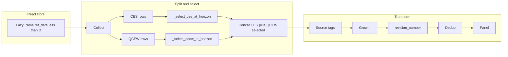

# Censoring: CES and QCEW extraction by ref_date horizon (D)

When a horizon **D** (date of form YYYY-MM-12) is provided, the vintage store pipeline filters to `ref_date < D` and selects exactly one row per ref_date per series using rank-based rules. This avoids vintage_date (holidays, shutdowns) and works for both estimation and backtesting.

---

## Goal

1. Restrict to **ref_date < D** (no vintage_date).
2. Within each series, **rank ref_date descending** (dense).
3. Keep exactly one row per ref_date using the rules below (CES vs QCEW).

D is always YYYY-MM-12 so the frontier period’s first release is already published.

---

## CES extraction

**Series key:** `(seasonally_adjusted, geographic_type, geographic_code, industry_type, industry_code)`.

- **Rank 1** → `(revision=0, benchmark_revision=0)`
- **Rank 2** → `(revision=1, benchmark_revision=0)`
- **Rank 3** → `(revision=2, benchmark_revision=0)`
- **Rank 4+** → `(revision=2, benchmark_revision=max(benchmark_revision))` per (series, ref_date)

This yields the triangular diagonal (1 rev-0, 1 rev-1, rest rev-2).

### Helper: CES rank-based selection

**File:** [src/alt_nfp/ingest/vintage_store.py](src/alt_nfp/ingest/vintage_store.py)

Add a **private** function (e.g. `_select_ces_at_horizon(ces_df: pl.DataFrame, D: date) -> pl.DataFrame`) that:

- Assumes `ces_df` is collected store rows with `source == "ces"` and columns including `ref_date`, `revision`, `benchmark_revision`, and the series key columns.
- Filters to `ref_date < D`.
- Defines series key: `["seasonally_adjusted", "geographic_type", "geographic_code", "industry_type", "industry_code"]`.
- Adds a column `_rank` = dense rank of `ref_date` descending within each series (e.g. `pl.col("ref_date").rank(descending=True, method="dense").over(series_key)`).
- Selects rows where:
  - `(_rank == 1) & (revision == 0)`, or
  - `(_rank == 2) & (revision == 1) & (benchmark_revision == 0)`, or
  - `(_rank == 3) & (revision == 2) & (benchmark_revision == 0)`, or
  - `(_rank >= 4) & (revision == 2)` and per (series_key, ref_date) keep the row with **max** `benchmark_revision` (e.g. sort by `benchmark_revision` descending and `unique(subset=series_key + ["ref_date"], keep="first")` on the rank>=4 subset).
- Returns the concatenation of these four subsets (drop `_rank` before return). No other columns dropped.

Implement with Polars only; keep the helper pure (no I/O).

---

## QCEW extraction (quarter-dependent)

**Series key:** `(geographic_type, geographic_code, industry_type, industry_code)` (QCEW has no seasonally_adjusted).

- **Pre-2017:** Keep only `revision == 0` (no rank logic).
- **2017+:** Add temporary column **quarter** = `(ref_date.month - 1) // 3 + 1` (Q1=1, Q2=2, Q3=3, Q4=4). Then:
  - **Rank 1** → `revision == 0`
  - **Rank 2** → `revision == 1`
  - **Rank 3** → `revision == 1` if `quarter == 4` else `revision == 2`
  - **Rank 4** → `revision == 1` if `quarter == 4`, `revision == 2` if `quarter == 3`, else `revision == 3`
  - **Rank 5+** → keep row with **max(revision)** per (series_key, ref_date)

QCEW schedule: Q1 has revisions 0–4, Q2 has 0–3, Q3 has 0–2, Q4 has 0–1.

### Helper: QCEW rank-based selection

**File:** [src/alt_nfp/ingest/vintage_store.py](src/alt_nfp/ingest/vintage_store.py)

Add a **private** function (e.g. `_select_qcew_at_horizon(qcew_df: pl.DataFrame, D: date) -> pl.DataFrame`) that:

- Assumes `qcew_df` is collected store rows with `source == "qcew"` and columns including `ref_date`, `revision`, and the series key columns.
- Filters to `ref_date < D`.
- **Pre-2017:** For rows with `ref_date.dt.year() < 2017`, keep only `revision == 0`.
- **2017+:** Add **quarter** and **_rank** (dense rank of ref_date descending within each series). Select one row per (series_key, ref_date) by the rank/quarter rules above. For rank >= 6, treat like rank 5: max(revision) per (series_key, ref_date).
- Concatenate pre-2017 result with 2017+ result; drop temporary columns (`_rank`, `quarter`) before return.

---

## Pipeline integration

### Optional horizon in `transform_to_panel`

**File:** [src/alt_nfp/ingest/vintage_store.py](src/alt_nfp/ingest/vintage_store.py)

- Add parameter **`as_of_ref: date | None = None`** to `transform_to_panel`.
- When **`as_of_ref` is None**: keep current behavior (no ref_date filter, current dedup logic).
- When **`as_of_ref` is set**:
  1. Filter the incoming lazy frame to **`ref_date < as_of_ref`**.
  2. **Collect** the frame.
  3. Split into CES (`source == "ces"`) and QCEW (`source == "qcew"`).
  4. Run **`_select_ces_at_horizon(ces_df, as_of_ref)`** and **`_select_qcew_at_horizon(qcew_df, as_of_ref)`**.
  5. Concatenate the selected CES rows with the selected QCEW rows.
  6. Continue the existing pipeline from source tags through project to PANEL_SCHEMA on the combined data (build a `pl.LazyFrame` from the combined DataFrame and run the same downstream steps).
  7. Collect and return the result.

Document that **D should be YYYY-MM-12** (BLS convention). Optionally validate `as_of_ref.day == 12` and log a warning or raise if not.

### Optional horizon in `build_panel`

**File:** [src/alt_nfp/ingest/panel.py](src/alt_nfp/ingest/panel.py)

- Add parameter **`as_of_ref: date | None = None`** to `build_panel`.
- When `as_of_ref` is set, pass it through to **`transform_to_panel(lf, geographic_scope="national", as_of_ref=as_of_ref)`**.
- Optional: when `as_of_ref` is set, restrict the store read to a ref_date range that excludes D.

No change to provider ingestion; providers are concatenated to the vintage panel as today.

### Backtest

**File:** [src/alt_nfp/backtest.py](src/alt_nfp/backtest.py)

- **Option A (recommended):** For each target month, call **`build_panel(as_of_ref=target_date)`** so the panel is built with ref_date < target_date and the rank-based CES/QCEW selection. Then call **`panel_to_model_data(panel, PROVIDERS, as_of=target_date)`** for cyclical indicators and any other vintage_date-based censoring. (One panel build per backtest iteration.)
- **Option B:** Keep a single full panel; use the new extraction only when the user explicitly builds a panel with a horizon.

Ensure **target_date** is in YYYY-MM-12 form (backtest gets target_dates from panel `period`, which is ref_date day=12).

### panel_adapter

When the panel is built with `as_of_ref`, CES and QCEW are already censored by horizon; **`panel_to_model_data(..., as_of=target_date)`** remains used for cyclical indicators and any other vintage_date-based censoring. No change to `panel_to_model_data` signature; for CES/QCEW built with `as_of_ref`, there is only one row per period so the effect is redundant but harmless.

---

## Summary flow (when `as_of_ref` is set)

---

## Tests

- **Unit test for `_select_ces_at_horizon`:** Build a small DataFrame of CES rows with multiple (ref_date, revision, benchmark_revision) per series, call `_select_ces_at_horizon(df, D)`, and assert one row per (series_key, ref_date) and the correct (revision, benchmark_revision) by rank.
- **Unit test for `_select_qcew_at_horizon`:** Build a small DataFrame of QCEW rows (2017+ and pre-2017) with multiple (ref_date, revision) per series and varying quarters; assert one row per (series_key, ref_date) and revision choices matching the rank/quarter rules.
- **Integration:** Build a panel with `as_of_ref` set and check that CES and QCEW rows have one row per (period, source, industry_code, ...) and that revision_number values match expectations. Mark as integration/store-dependent if it needs the built store.
