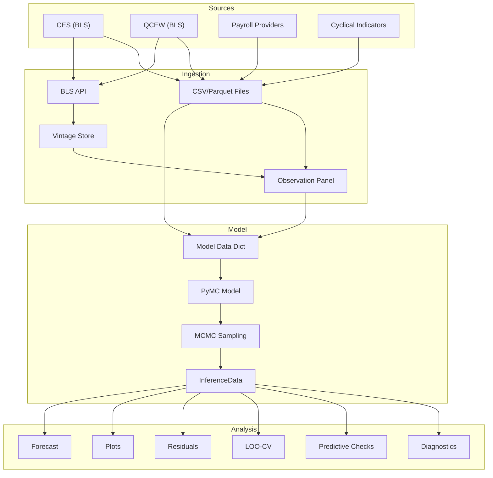
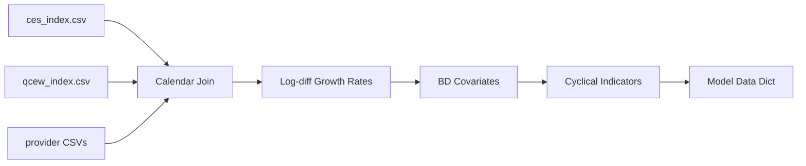
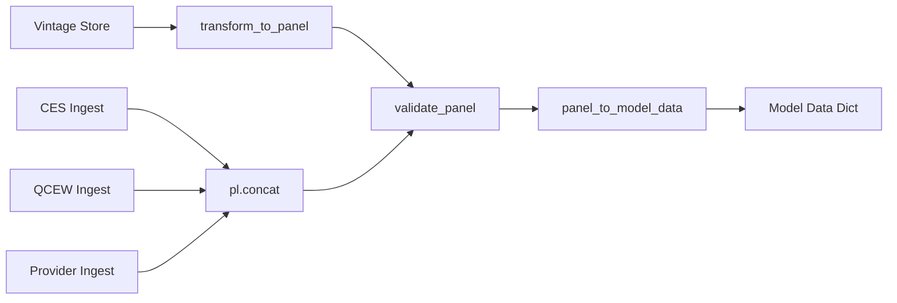

# Data Flow

This page traces how data moves through the `alt_nfp` system from raw
sources to final output artifacts.

## High-Level Pipeline

## Data Loading Paths

### Legacy Path (`data.load_data`)

1. Read CES and QCEW CSVs into Polars DataFrames.
2. Build monthly calendar spanning the CES date range.
3. Left-join all sources onto the calendar.
4. Compute log-difference growth rates.
5. Compute BD covariates (birth rate, lagged QCEW proxy).
6. Load and align cyclical indicators.
7. Assemble the model data dict.

### Panel Path (`build_panel` → `panel_to_model_data`)

1. Try reading from Hive-partitioned vintage store.
2. Fall back to per-source ingestion (CES, QCEW from files/API).
3. Ingest payroll providers from CSV.
4. Concatenate all parts and validate against `PANEL_SCHEMA`.
5. Convert validated panel to model data dict via `panel_to_model_data`.

## Model Data Dict Structure

The dict consumed by `build_model()` and all downstream functions:

| Key | Type | Description |
|---|---|---|
| `dates` | `list[date]` | Monthly calendar |
| `T` | `int` | Number of time periods |
| `month_of_year` | `ndarray[int]` | 0-indexed month (0=Jan) |
| `year_of_obs` | `ndarray[int]` | Year index (0-based) |
| `n_years` | `int` | Number of distinct years |
| `g_ces_sa` | `ndarray[float]` | CES SA growth rates |
| `g_ces_nsa` | `ndarray[float]` | CES NSA growth rates |
| `g_qcew` | `ndarray[float]` | QCEW growth rates |
| `qcew_obs` | `ndarray[int]` | Indices where QCEW is observed |
| `qcew_is_m3` | `ndarray[bool]` | Quarter-end month flags |
| `pp_data` | `list[dict]` | Per-provider data dicts |
| `birth_rate_c` | `ndarray[float]` | Centred birth rate |
| `bd_qcew_c` | `ndarray[float]` | Centred lagged QCEW BD proxy |
| `g_ces_sa_by_vintage` | `list[ndarray]` | CES SA by vintage [v1, v2, v3] |
| `g_ces_nsa_by_vintage` | `list[ndarray]` | CES NSA by vintage [v1, v2, v3] |
| `levels` | `DataFrame` | Index levels for plotting |

Each provider dict in `pp_data` contains:

| Key | Type | Description |
|---|---|---|
| `name` | `str` | Display name |
| `config` | `ProviderConfig` | Full configuration |
| `g_pp` | `ndarray[float]` | Growth rates |
| `pp_obs` | `ndarray[int]` | Observed indices |
| `births` | `ndarray[float]` or `None` | Birth-rate array |
| `color` | `str` | Plot colour hex |

## Output Artifacts

| Artifact | Format | Location |
|---|---|---|
| InferenceData | NetCDF | `output/idata.nc` |
| Diagnostic plots | PNG | `output/*.png` |
| Forecast tables | Console + PNG | `output/forecast_*.png` |
| Backtest results | Console + PNG | `output/nowcast_backtest.png` |
| Sensitivity results | Console + PNG | `output/sensitivity_*.png` |
| Observation panel | Parquet | `data/processed/observation_panel.parquet` |
| Panel manifest | JSON | `data/processed/panel_manifest.json` |
