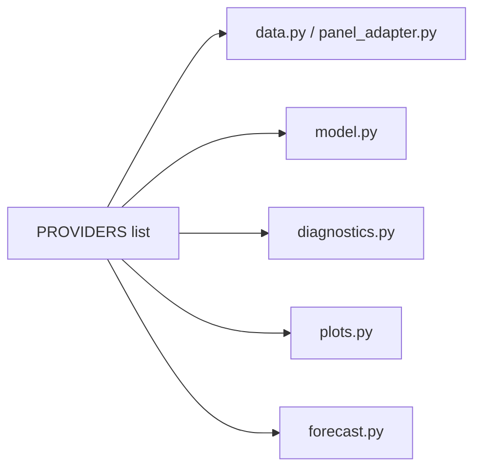

# System Design

## Package Structure

```
src/alt_nfp/
├── __init__.py            # Public API surface
├── config.py              # Paths, constants, provider registry
├── data.py                # Legacy CSV → model dict
├── model.py               # PyMC model definition
├── sampling.py            # MCMC sampling (nutpie / PyMC)
├── panel_adapter.py       # Observation panel → model dict
├── diagnostics.py         # Convergence checks, source contributions
├── checks.py              # Prior/posterior predictive, LOO-CV
├── residuals.py           # Standardised residual plots
├── plots.py               # Growth, seasonal, index, BD plots
├── forecast.py            # Forward simulation
├── backtest.py            # CES-censoring nowcast backtest
├── sensitivity.py         # QCEW sigma sensitivity sweep
├── lookups/               # Static reference tables
│   ├── industry.py        # NAICS hierarchy + CES series ID map
│   ├── revision_schedules.py  # Revision specs + publication calendar
│   ├── publication_dates.py   # Hard-coded BLS release dates
│   ├── update_schedule.py     # CLI to fetch new dates
│   └── geography.py      # State/area geography hierarchy
├── ingest/                # Raw data → observation panel
│   ├── base.py            # PANEL_SCHEMA, validate_panel
│   ├── panel.py           # build_panel, save/load
│   ├── ces_national.py    # CES national ingestion
│   ├── ces_state.py       # CES state ingestion
│   ├── qcew.py            # QCEW ingestion
│   ├── payroll.py         # Provider ingestion
│   ├── aggregate.py       # Geographic aggregation
│   ├── releases.py        # Release management
│   ├── tagger.py          # Source/vintage metadata tagging
│   ├── vintage_store.py   # Hive-partitioned Parquet store
│   ├── bls/               # BLS API client
│   │   ├── _http.py       # HTTP transport
│   │   ├── _programs.py   # Program definitions
│   │   ├── ces_national.py
│   │   ├── ces_state.py
│   │   └── qcew.py
│   └── release_dates/     # Publication schedule tracking
│       ├── config.py
│       ├── parser.py
│       ├── scraper.py
│       └── vintage_dates.py
└── vintages/              # Vintage data pipeline
    ├── __main__.py        # CLI entry point
    ├── _client.py         # Utilities
    ├── build_store.py     # Store builder
    ├── views.py           # real_time_view, final_view
    ├── evaluation.py      # vintage_diff, noise multipliers
    ├── download/          # BLS data downloaders
    │   ├── ces.py
    │   └── qcew.py
    └── processing/        # Data processors
        ├── ces_national.py
        ├── qcew.py
        ├── sae_states.py
        └── combine.py
```

## Design Patterns

### Config-Driven Provider Registry

The `PROVIDERS` list in `config.py` is the single source of truth for
which payroll providers are active.  Every downstream component — model
building, diagnostics, plotting, forecasting — loops over this list:



### Two Data Paths

The system supports two data-loading paths:

| Path | Entry Point | Use Case |
|---|---|---|
| **Legacy** | `data.load_data()` | Flat CSVs in `data/` |
| **Panel** | `build_panel()` → `panel_to_model_data()` | Vintage store or API |

Both produce the same `dict` structure consumed by `build_model()`.

### Lazy Vintage Views

Vintage views (`real_time_view`, `final_view`, `specific_vintage_view`)
operate on Polars `LazyFrame`s, enabling efficient composition without
materialising intermediate tables:

```python
panel_lf = panel.lazy()
rt = real_time_view(panel_lf, as_of=date(2024, 6, 15))
diff = vintage_diff(panel_lf, "ces_sa", rev_a=0, rev_b=-1)
# Nothing computed until .collect()
```

### Hive-Partitioned Storage

The vintage store uses Hive-style partitioning by `source` and
`vintage_date`, enabling partition pruning for efficient reads:

```python
lf = read_vintage_store(path, ref_date_range=(start, end))
# Only reads relevant partitions
```

## Module Responsibilities

| Module | Responsibility | Key Exports |
|---|---|---|
| `config` | Paths, constants, provider specs | `PROVIDERS`, `ProviderConfig`, `DATA_DIR` |
| `data` | CSV loading, growth-rate computation | `load_data()`, `build_obs_sources()` |
| `model` | PyMC model definition | `build_model()` |
| `sampling` | MCMC execution | `sample_model()`, preset configs |
| `panel_adapter` | Panel → model dict conversion | `panel_to_model_data()` |
| `diagnostics` | Post-sampling analysis | `print_diagnostics()`, `plot_divergences()` |
| `checks` | Predictive checks, LOO-CV | `run_prior_predictive_checks()`, `run_loo_cv()` |
| `residuals` | Residual plots | `plot_residuals()` |
| `plots` | Result visualisations | `plot_growth_and_seasonal()`, etc. |
| `forecast` | Forward simulation | `forecast_and_plot()` |
| `backtest` | CES-censoring experiment | `run_backtest()` |
| `sensitivity` | QCEW noise sensitivity | `run_sensitivity()` |
| `lookups` | Static reference data | `INDUSTRY_HIERARCHY`, revision schedules |
| `ingest` | Raw → panel pipeline | `build_panel()`, `validate_panel()` |
| `vintages` | Revision tracking pipeline | `real_time_view()`, `vintage_diff()` |

## Error Handling Strategy

- **Data loading**: missing files and columns are handled gracefully with
  warnings (not exceptions) where possible.
- **Sampling**: nutpie failures fall back to PyMC NUTS automatically.
- **Ingestion**: per-source failures are caught and logged; the panel
  builder continues with available sources.
- **Validation**: `validate_panel()` raises `ValueError` with specific
  messages for schema violations, duplicates, and invalid values.
