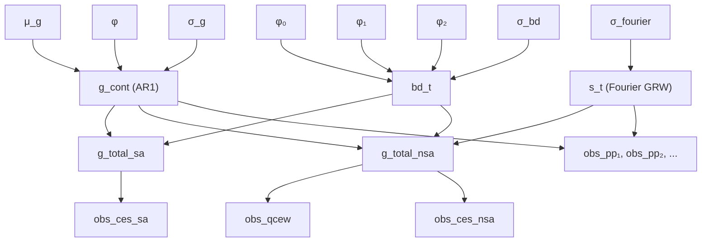

# Model Overview

The `alt_nfp` state-space model decomposes total nonfarm payroll (NFP)
employment growth into three latent components observed through multiple
noisy data sources.

## Model Components

### 1. Latent Continuing-Units Growth \( g^{\text{cont}}_t \)

An AR(1) process with mean reversion captures the persistent component of
employment growth from continuing business establishments:

\[
g^{\text{cont}}_t = \mu_g + \phi \left( g^{\text{cont}}_{t-1} - \mu_g \right) + \sigma_g \, \varepsilon_t, \quad \varepsilon_t \sim \mathcal{N}(0, 1)
\]

| Parameter | Prior | Interpretation |
|---|---|---|
| \(\mu_g\) | \(\mathcal{N}(0.001, 0.005)\) | Long-run mean monthly growth |
| \(\phi\) | \(\text{Uniform}(0, 0.99)\) | Persistence |
| \(\sigma_g\) | \(\text{HalfNormal}(0.005)\) | Innovation volatility |

### 2. Fourier Seasonal \( s_t \)

Seasonal patterns are captured via a Fourier expansion with annually-evolving
amplitudes. The coefficients follow a Gaussian random walk across years:

\[
s_t = \sum_{k=1}^{K} \left[ A_k(y_t) \cos\!\left(\frac{2\pi k \, m_t}{12}\right) + B_k(y_t) \sin\!\left(\frac{2\pi k \, m_t}{12}\right) \right]
\]

where \( K = 4 \) harmonics, \( m_t \) is the month index, and \( y_t \) is the
year index. The GRW innovation standard deviation decreases with harmonic
order \( k \), so higher-frequency seasonals evolve more slowly.

### 3. Structural Birth/Death Offset \( \text{bd}_t \)

The birth/death model captures the net contribution of business openings and
closings that are not directly observed in the payroll-provider universe:

\[
\text{bd}_t = \varphi_0 + \varphi_1 \cdot \text{birth\_rate}_c + \varphi_2 \cdot \text{bd}^{\text{QCEW}}_{c,\, t-L} + \varphi_3 \cdot X^{\text{cycle}}_t + \sigma_{\text{bd}} \cdot \xi_t
\]

| Parameter | Prior | Interpretation |
|---|---|---|
| \(\varphi_0\) | \(\mathcal{N}(0.001, 0.002)\) | Intercept (mean BD at average covariates) |
| \(\varphi_1\) | \(\mathcal{N}(0.5, 0.5)\) | Birth-rate loading |
| \(\varphi_2\) | \(\mathcal{N}(0.3, 0.3)\) | QCEW BD-proxy loading (lagged 6 months) |
| \(\varphi_3\) | \(\mathcal{N}(0, 0.3)\) | Cyclical indicator loadings |
| \(\sigma_{\text{bd}}\) | \(\text{HalfNormal}(0.001)\) | BD innovation |

Covariates are centred so that when unavailable (early sample, nowcast
horizon) the centred value is zero and \(\text{bd}_t\) collapses to
\(\varphi_0 + \sigma_{\text{bd}} \cdot \xi_t\).

### Composite Growth Signals

The model forms three composite signals:

| Signal | Formula | Use |
|---|---|---|
| SA total growth | \( g^{\text{cont}}_t + \text{bd}_t \) | CES SA likelihood, forecast |
| NSA total growth | \( g^{\text{cont}}_t + s_t + \text{bd}_t \) | CES NSA and QCEW likelihoods |
| Continuing-units NSA | \( g^{\text{cont}}_t + s_t \) | Provider likelihoods |

## Observation Models

### QCEW — Truth Anchor

QCEW is treated as the near-census ground truth with fixed observation
noise:

\[
y^{\text{QCEW}}_t \sim \mathcal{N}\!\left( g^{\text{total,NSA}}_t,\; \sigma^{\text{QCEW}}_t \right)
\]

where \(\sigma^{\text{QCEW}}_t\) is 0.05 %/month for quarter-end (M3) months
and 0.15 %/month for retrospective-UI (M1–2) months.

### CES — Vintage-Specific Noise

CES observations have shared bias and loading but vintage-specific noise:

\[
y^{\text{CES},v}_t \sim \mathcal{N}\!\left( \alpha_{\text{CES}} + \lambda_{\text{CES}} \cdot g^{\text{total}}_t,\; \sigma^v_{\text{CES}} \right)
\]

where \( v \in \{1, 2, 3\} \) indexes first print, second print, and final
vintage.

### Payroll Providers — Config-Driven

Each provider \( p \) has its own bias, loading, and noise:

\[
y^p_t \sim \mathcal{N}\!\left( \alpha_p + \lambda_p \cdot g^{\text{cont,NSA}}_t,\; \sigma_p \right)
\]

Providers with `error_model="ar1"` use a conditional likelihood that
accounts for autocorrelated measurement error (e.g., multi-establishment
restructuring).

## Directed Acyclic Graph

