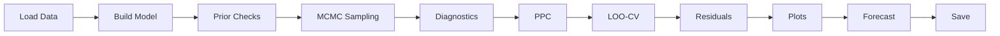

# Running the Pipeline

## Full Estimation

The main entry point runs the complete Bayesian workflow:

```bash
uv run python alt_nfp_estimation_v3.py
```

### Pipeline Steps



Each step can also be run independently using the Python API.

## Nowcast Backtest

The backtest quantifies how well the model nowcasts employment growth
when CES data is not yet available:

```python
from alt_nfp import run_backtest

# Backtest last 24 months
results = run_backtest(n_backtest=24)
```

For each month, CES is censored from that date onward, the model is fit
with `LIGHT_SAMPLER_KWARGS`, and the nowcast is compared to the actual
CES release.

**Output metrics:**

- MAE and RMSE for jobs-added and growth-rate errors.
- Breakdown by data availability (data-rich, PP2-only, no alt data).

## Sensitivity Analysis

Test whether QCEW noise calibration drives conclusions:

```python
from alt_nfp import run_sensitivity

results = run_sensitivity()
```

Default configurations: 0.5x, 1x, 2x baseline QCEW noise.  Custom grids:

```python
from alt_nfp.sensitivity import SIGMA_QCEW_M3, SIGMA_QCEW_M12

configs = [
    ("0.25x", SIGMA_QCEW_M3 * 0.25, SIGMA_QCEW_M12 * 0.25),
    ("1x",    SIGMA_QCEW_M3,         SIGMA_QCEW_M12),
    ("4x",    SIGMA_QCEW_M3 * 4.0,   SIGMA_QCEW_M12 * 4.0),
]
results = run_sensitivity(configs=configs)
```

## Vintage Pipeline

Download, process, and store real-time data vintages:

```bash
# Full CLI
uv run python -m alt_nfp.vintages

# Or programmatically
from alt_nfp.vintages import real_time_view, final_view
```

See [Vintage Management](vintage-management.md) for details.

## Update BLS Publication Dates

```bash
uv run python -m alt_nfp.lookups.update_schedule
```

Fetches new release dates from BLS schedule pages and prints copy-paste-ready
dict entries for `publication_dates.py`.

## Build Publication Calendar

```bash
uv run python scripts/build_publication_calendar.py
```

Merges historical and hard-coded dates into `publication_calendar.parquet`.
